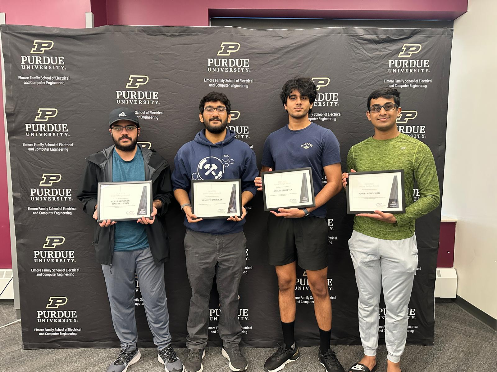
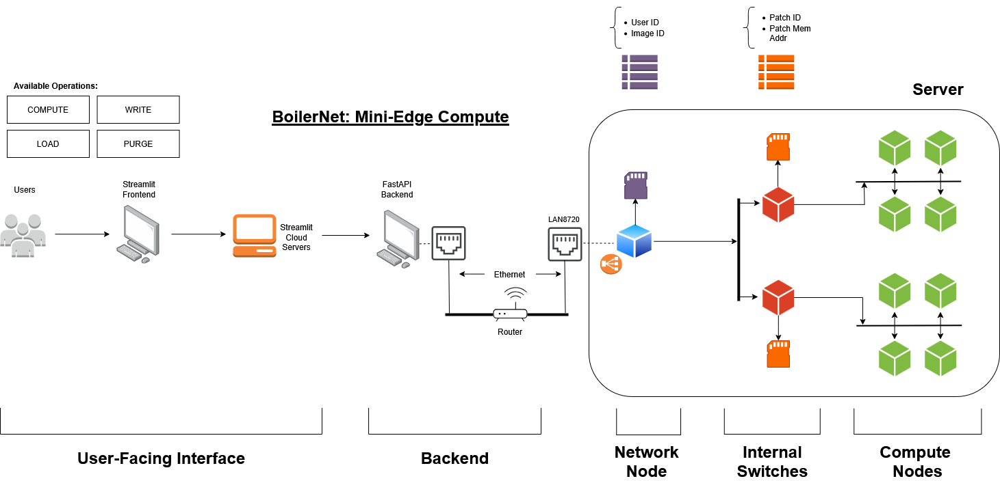
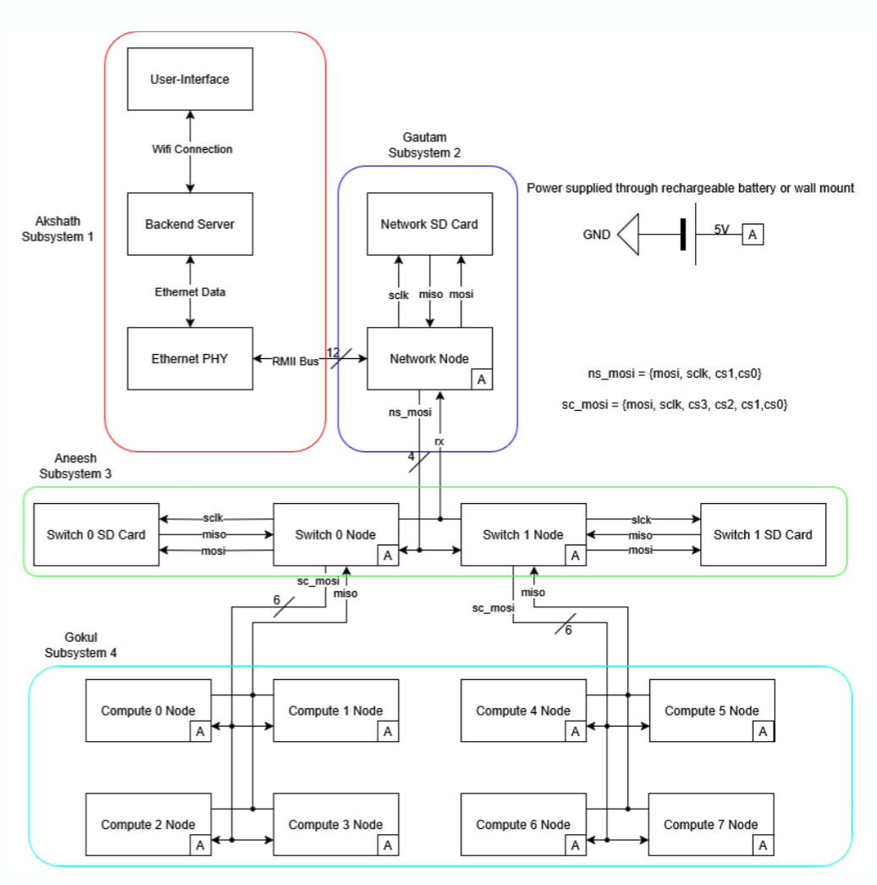
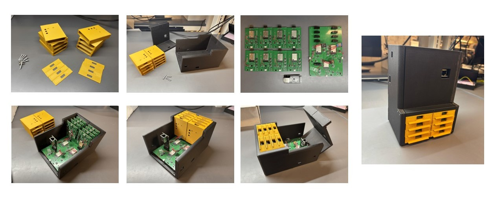
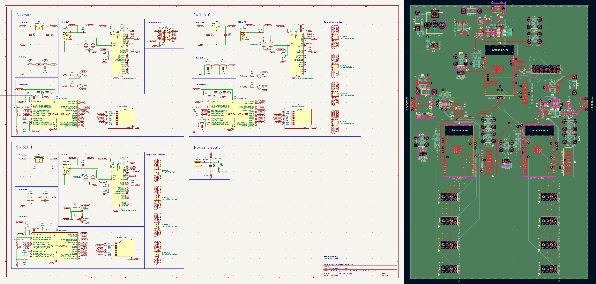
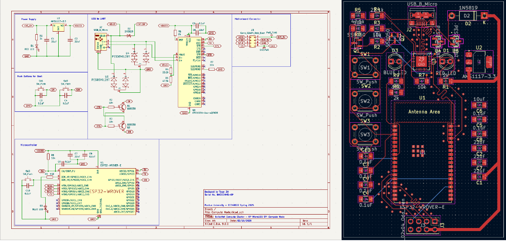
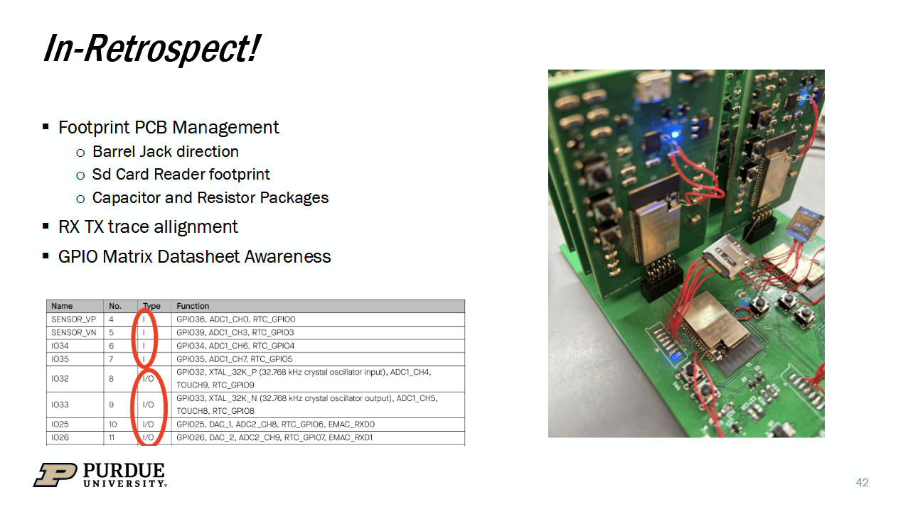

# BoilerNet: A Compute-Enabled Mini-NAS

  
  

    BoilerNet Team 20! 
    From L to R: Gokulkrishnan Harikrishnan, Akshath Raghav Ravikiran, Aneesh Reddy Poddutur, Gautum Kottayil Nambiar

## Overview 

This project aimed to develop a Network Attached Storage utilizing ESP32 MCUs. The aptly-named BoilerNet aims to enable In-Network-compute alongside swappable disks and compute workloads, neatly brought together by a cloud-hosted Dashboard interface. There are a few core ideas that form the foundation for this ”cluster” – Low Power Usage, Plug-and-Play Workloads, High Scalability.

> Our reports/presentations are linked in the [/docs](./docs/). They contain in-depth views, reasonings and explanations regarding the design and its motivation. We also outline how we tested and ensured functionality. **This repository is just meant to help anyone who wishes to "refer" to our code/designs for their own use-case.**

  
  

    Top Level System Diagrams

## Mechanical Design

The physical enclosure consists of six piece types, along with an optional divider: 1x Enclosure Lid, 1x Enclosure Base, 8x compute Enclosures, 8x compute Enclosure Lids, 6x
3mm diameter - 20mm screws, 4x 3mm diameter - 5 mm screws. You can find the related CAD files at [/cad/](./cad/) w/o dependencies. Reach out to [Aneesh Poddutur](https://www.linkedin.com/in/aneesh-poddutur/) for more information. 

  
  <caption> 

    Physical Enclosure

  

    Top Enclosure

  

    Compute Enclosure

  

    Assembled System!

## PCB Design

This was our first time working on PCB Design, and had a few fly-wires hanging about. Below is one of the slides we usd in our [Final Presentation](/docs/Final%20Design%20Review.pdf) to sound endearing ;)

You can find our PCB Designs at [/gerbers/](./gerbers/) and [/kicad_projects](./kicad_projects/)! Reach out to [Gautam Nambiar](https://www.linkedin.com/in/gautam-nambiar-821479251/) and [Gokul Harikrishnan](https://www.linkedin.com/in/gokulkrishnan-harikrishnan-40334b227/) if you have any questions.

  

    Network/Switch PCB

  

    Compute Node PCB

  

    Mishaps/Learnings!

## Software 

All the code for the MCUs are maintained within the [/src](./src/) folder. Each node's build is maintained within it's own ESP-IDF setup, and can be configured in isolation. 
[/model_train](./model_train/) contains the code for training the models and preparing weights to flashed through [./compute_nodes](./src/compute_nodes/). Please reach out to [Akshath Raghav](https://www.linkedin.com/in/akshathrr/) if you have any questions!

- [/src/fastapi_backend](./src/fastapi_backend/) and [/src/streamlit_frontend](./src/streamlit_frontend/) can be configured using the Makefiles. Try `make venv; make setup; make run`. 
- [/src/network_node](./src/network_node/), [/src/switch_nodes](./src/switch_nodes/) and [/src/compute_nodes](./src/compute_nodes/) require `idf.py` configured and `IDF_PATH` set up. Remember, `idf.py` should be run in an ESP-IDF project directory, i.e., a directory containing a CMakeLists.txt file. `idf.py fullclean; idf.py build; idf.py flash -port /dev/ttyUSB1` will be sufficient. 
- [/model_train/extract.sh](./model_train/extract.sh) has the script for setting up ImageNet -- only if you want to train your own subsets. Thanks to [BIGBALLON](https://gist.github.com/BIGBALLON) for this [script](https://gist.github.com/BIGBALLON/8a71d225eff18d88e469e6ea9b39cef4). 
- [/model_train/train.py](./model_train/train.py) and [/model_train/convert_and_header.py](./model_train/convert_and_header.py) will set you up quickly with training your MobileNet or EfficientNet backbones with a head for the subset you've chosen, and then quantizing them (w/ additional calibration tuning). Results will be put into [/model_train/models](./model_train/models/) and [/model_train/quantized_models](./model_train/quantized_models/). After you're done training, put the chosen header (.cc) file into [/src/compute_nodes/main](./src/compute_nodes/main/) and put this file name into Line 5 in [/src/compute_nodes/main/CMakeLists.txt](/src/compute_nodes/main/CMakeLists.txt). 

---